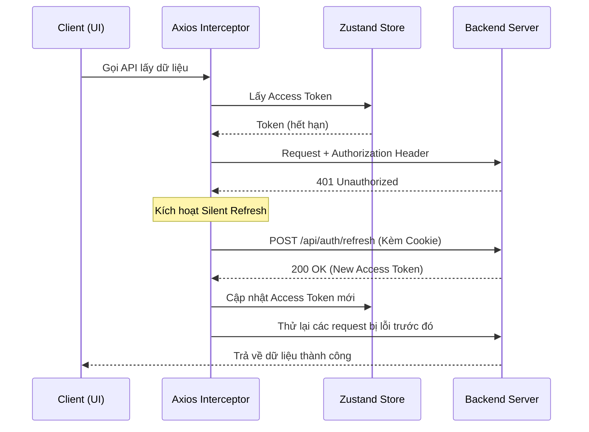

# Cơ chế Refresh Token (Silent Refresh)

Tài liệu này giải thích cách triển khai hệ thống xác thực và làm mới token tự động trong dự án HCM Mirai.

## 1. Tổng quan kiến trúc
Dự án sử dụng cơ chế **Silent Refresh** để duy trì phiên đăng nhập của người dùng mà không cần yêu cầu đăng nhập lại khi Access Token hết hạn.

- **Access Token:** Lưu trong RAM (Zustand Store), gửi qua Header `Authorization`.
- **Refresh Token:** Lưu trong HttpOnly Cookie (Server-side), tự động gửi kèm khi gọi API refresh.

## 2. Các thành phần chính

### 2.1. Store quản lý trạng thái (`src/store/auth.store.ts`)
Sử dụng Zustand để lưu trữ `accessToken` và thông tin người dùng. Trạng thái này sẽ bị mất khi tải lại trang (F5), lúc đó hệ thống sẽ dựa vào Refresh Token để lấy lại Access Token mới.

### 2.2. Axios Interceptors (`src/lib/axios.ts`)
Đây là "trái tim" của cơ chế refresh token.

#### Request Interceptor
Trước mỗi yêu cầu, interceptor sẽ lấy `accessToken` từ store và gắn vào header:
```typescript
config.headers.set("Authorization", `Bearer ${accessToken}`);
```

#### Response Interceptor (Xử lý lỗi 401)
Khi Server phản hồi lỗi `401 Unauthorized`, interceptor sẽ thực hiện các bước sau:
1. **Kiểm tra vòng lặp:** Nếu đã thử refresh mà vẫn lỗi, hệ thống sẽ logout.
2. **Hàng đợi (Queue):** Nếu có nhiều request cùng lỗi 401, chỉ request đầu tiên được phép gọi API refresh. các request sau sẽ được đưa vào `failedQueue` để xử lý sau khi có token mới.
3. **Gọi Refresh API:** Gọi đến endpoint `/api/auth/refresh` với `withCredentials: true`.
4. **Cập nhật & Thử lại:** Sau khi có token mới, cập nhật vào store và thực thi lại các request ban đầu.

## 3. Quy trình chi tiết (Workflow)



## 4. Bảo mật
- **XSS Protection:** Refresh Token được lưu trong `HttpOnly Cookie`, ngăn chặn các đoạn mã JavaScript độc hại đánh cắp token.
- **CSRF Protection:** Được đảm bảo bởi các cơ chế bảo mật của Backend và việc sử dụng Access Token trong Header.
- **Hạn chế gọi lặp:** Sử dụng biến flag `isRefreshing` và `failedQueue` để tối ưu số lượng request lên server.

## 5. Xử lý lỗi ngoại lệ
Nếu Refresh Token cũng hết hạn (Server trả về 403 hoặc 401 cho chính API refresh):
1. Xóa sạch dữ liệu trong `authStore`.
2. Chuyển hướng người dùng về trang đăng nhập admin (`/admin/login`).
